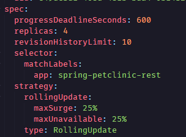
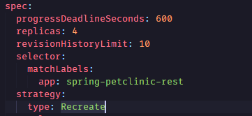

# Module 11 Reflection Notes

## Reflection on Hello Minikube

1. Berikut adalah foto dari logs:

    

    Warna merah adalah logs sebelum Service di-expose, dan warna kuning adalah logs setelah Service di-expose. Ketika aplikasi sudah di-expose, logs menampilkan request yang masuk ke Service. Dalam hal ini, karena Service diakses di browser pada endpoint "/", maka yang tampil di logs adalah beberapa GET request yang me-request endpoint "/".Setiap kali aplikasi dibuka pada browser atau di-refresh, jumlah entry di log juga turut bertambah. Hal ini karena setiap kali aplikasi dibuka, browser akan melakukan GET request ke service. Request-request inilah yang dicatat pada log service.

2. Opsi `-n` digunakan untuk menspesifikasikan sebuah namespace ketika menjalankan command `kubectl`. Namespace adalah semacam sebuah 'group' atau 'kelompok' yang dihasilkan dari mekanisme Kubernetes untuk 'mengisolasikan' beberapa resource dalam satu cluster menjadi beberapa kelompok. Dalam contoh di tutorial, ketika kita menjalankan `kubectl get pods,services -n kube-system`, maka yang akan dicetak hanyalah pods dan services yang terdefinisi dalam namespace `kube-system`, yaitu namespace untuk objek-objek yang dibuat oleh sistem Kubernetes. Itulah mengapa pods dan services yang telah didefinisikan secara eksplisit oleh user tidak ditampilkan, karena itu bukan merupakan objek 'bawaan' buatan Kubernetes. Tanpa opsi `-n`, maka secara default perintah `kubectl get` hanya akan menampilkan resource-resource yang telah secara eksplisit dibuat oleh pengguna.

## Reflection on Rolling Update & Kubernetes Manifest File

1. Strategi Recreate adalah strategi yang akan mengakhiri process setiap pod yang sedang berjalan sebelum membuat pod baru. Sementara itu, strategi Rolling Update mengupdate pod dengan cara "rolling update", yaitu mengupdate suatu deployment tanpa perlu mengakhiri prosesnya terlebih dahulu (zero downtime). Dengan strategi recreate, waktu yang dibutuhkan proses deployment dapat dipersingkat dan implementasinya juga tidak begitu sulit. Akan tetapi, strategi recreate menyebabkan adanya downtime dan memiliki resiko lebih besar karena adanya replacement secara keseluruhan. Sementara itu, penggunaan strategi rolling update dapat meningkatkan availability karena tidak adanya downtime serta dapat meminimalkan resiko terjadinya kerusakan karena update yang dilakukan secara bertahap. Akan tetapi, strategi ini meningkatkan kompleksitas implementasi dan prosesnya lebih lambat dibandingkan dengan strategi recreate.

2. Dalam mengubah Spring Petclinic REST agar menggunakan Recreate strategy, salah satu cara yang bisa dilakukan adalah dengan mengganti secara eksplisit bagian "strategy" pada manifest file menjadi Recreate. Pada `deployment.yml`, terdapat bagian ini:

    

    Kita perlu mengganti bagian tersebut menjadi:

    

    Dengan ini, apabila dijalankan deployment baru dengan menggunakan manifest file, secara otomatis deployment yang dijalankan akan menggunakan strategi Recreate untuk melakukan deployment.

3. Pada repositori Git ini, saya sudah membuat berkas bernama `recreate-deployment.yaml`, dengan isi sebagai berikut:

    ```yaml
    apiVersion: apps/v1
    kind: Deployment
    metadata:
    annotations:
        deployment.kubernetes.io/revision: "4"
    creationTimestamp: "2024-05-14T05:56:17Z"
    generation: 5
    labels:
        app: spring-petclinic-rest
    name: spring-petclinic-rest
    namespace: default
    resourceVersion: "1622"
    uid: e49dc3d1-408d-481b-bda4-0b1432c245dc
    spec:
    progressDeadlineSeconds: 600
    replicas: 4
    revisionHistoryLimit: 10
    selector:
        matchLabels:
        app: spring-petclinic-rest
    strategy:
        type: Recreate
    template:
        metadata:
        creationTimestamp: null
        labels:
            app: spring-petclinic-rest
        spec:
        containers:
            - image: docker.io/springcommunity/spring-petclinic-rest:3.2.1
            imagePullPolicy: IfNotPresent
            name: spring-petclinic-rest
            resources: {}
            terminationMessagePath: /dev/termination-log
            terminationMessagePolicy: File
        dnsPolicy: ClusterFirst
        restartPolicy: Always
        schedulerName: default-scheduler
        securityContext: {}
        terminationGracePeriodSeconds: 30
    status:
    availableReplicas: 3
    conditions:
        - lastTransitionTime: "2024-05-14T05:59:21Z"
        lastUpdateTime: "2024-05-14T05:59:21Z"
        message: Deployment has minimum availability.
        reason: MinimumReplicasAvailable
        status: "True"
        type: Available
        - lastTransitionTime: "2024-05-14T05:56:17Z"
        lastUpdateTime: "2024-05-14T06:14:07Z"
        message: ReplicaSet "spring-petclinic-rest-54f476f68" is progressing.
        reason: ReplicaSetUpdated
        status: "True"
        type: Progressing
    observedGeneration: 5
    readyReplicas: 3
    replicas: 4
    unavailableReplicas: 1
    updatedReplicas: 4
    ```

    Dengan menggunakan manifest file ini, maka deployment strategy yang dilakukan akan menggunakan strategy Recreate.

4. Dengan menggunakan Kubernetes manifest files, pembuatan deployment menjadi lebih efisien dibandingkan dengan menjalankan dari awal _from scratch_. Hal tersebut karena dengan manifest files, kita sudah menentukan apa saja konfigurasi yang ingin dijalankan ketika melakukan deployment, seperti misalnya jumlah replika yang ingin dijalankan, jenis strategi deployment, dan lain-lain. Selain itu, manifest files bisa juga di-track dalam version control seperti Git sehingga mudah apabila kita ingin melakukan update atau version rollback. Apabila ada orang lain yang ingin melakukan deployment yang sama, deployment juga bisa dilakukan secara konsisten dan meminimalkan potensi terjadinya error karena adanya beda konfigurasi. Secara garis besar, dengan manifest files deployment dapat menjadi lebih reproduceable, efisien, dan konsisten.