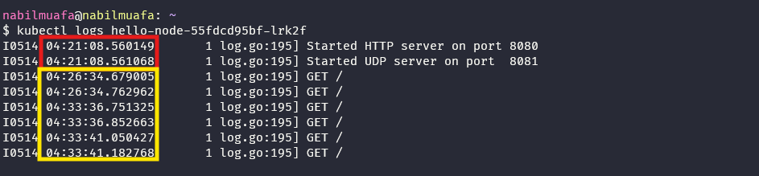

# Module 11 Reflection Notes

## Reflection on Hello Minikube

1.

Warna merah adalah logs sebelum Service di-expose, dan warna kuning adalah logs setelah Service di-expose. Ketika aplikasi sudah di-expose, logs menampilkan request yang masuk ke Service. Dalam hal ini, karena Service diakses di browser pada endpoint "/", maka yang tampil di logs adalah beberapa GET request yang me-request endpoint "/".Setiap kali aplikasi dibuka pada browser atau di-refresh, jumlah entry di log juga turut bertambah. Hal ini karena setiap kali aplikasi dibuka, browser akan melakukan GET request ke service. Request-request inilah yang dicatat pada log service.

2. Opsi `-n` digunakan untuk menspesifikasikan sebuah namespace ketika menjalankan command `kubectl`. Namespace adalah semacam sebuah 'group' atau 'kelompok' yang dihasilkan dari mekanisme Kubernetes untuk 'mengisolasikan' beberapa resource dalam satu cluster menjadi beberapa kelompok. Dalam contoh di tutorial, ketika kita menjalankan `kubectl get pods,services -n kube-system`, maka yang akan dicetak hanyalah pods dan services yang terdefinisi dalam namespace `kube-system`, yaitu namespace untuk objek-objek yang dibuat oleh sistem Kubernetes. Itulah mengapa pods dan services yang telah didefinisikan secara eksplisit oleh user tidak ditampilkan, karena itu bukan merupakan objek 'bawaan' buatan Kubernetes. Tanpa opsi `-n`, maka secara default perintah `kubectl get` hanya akan menampilkan resource-resource yang telah secara eksplisit dibuat oleh pengguna.
